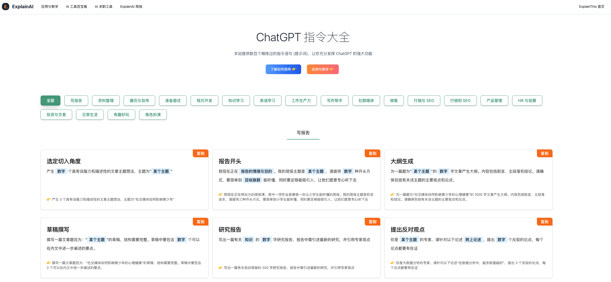

# AI探索者周刊 2023-04 

## 1. ChatGPT 指令大全

https://www.explainthis.io/zh-hans/chatgpt

## 2. Meta发布的SAM模型

Meta发布的SAM模型,实现分割一切的功能!最近,来自NTU、KCL和同济的团队基于Meta的SAM,提出了全新的模型Relate Anything Model:联系一切。Relate-Anything-Model(RAM)的机器学习模型赋予了Segment Anything Model(SAM)识别不同视觉概念之间的各种视觉关系的能力。

演示地址:https://huggingface.co/spaces/mmlab-ntu/relate-anything-model

代码地址:https://github.com/Luodian/RelateAnything

数据集地址:https://github.com/Jingkang50/OpenPSG

##  3. GPT-4的心智理论,已经超越了人类!

最近,约翰斯·霍普金斯大学的专家发现,GPT-4可以利用思维链推理和逐步思考,大大提升了自己的心智理论性能。在一些测试中,人类的水平大概是87%,而GPT-4,已经达到了天花板级别的100%!此外,在适当的提示下,所有经过RLHF训练的模型都可以实现超过80%的准确率。

论文地址:https://arxiv.org/abs/2304.11490

## 4. Pactum Al
洪尔玛用名为“Pactum Al” 的聊天机器人自动和供应商议价，它不仅让沃尔玛平均多省下 3% 的开销，而且每四个供应商中就有三个偏好与 Al 讨价还价，而非与人类沟通。

## 5. 类似 ChatPDF 产品实现原理
之前看过一篇介绍类似 ChatPDF 产品实现原理的文章，写的比较细致，也是采用了 text embedding 和矢量搜索技术，

https://blog.devgenius.io/chat-with-document-s-using-openai-chatgpt-api-and-text-embedding-6a0ce3dc8bc8?gi=12a84746ab92

## 6.  吴恩达发布新的AI课程
前谷歌/百度AI部门负责人吴恩达和OpenAI合作推出了免费的Prompt Engineering课程。课程主要内容是教你书写AI提示词，并且最后会教你利用GPT开发一个AI聊天机器人。

https://www.deeplearning.ai/short-courses/chatgpt-prompt-engineering-for-developers/

## 7.     chatgpt插件推荐

https://xaxa8r9cgu6.feishu.cn/docx/SRMrdmYxcoqA9Kxq47HcPgqhnKg

## 8. chatGPT的替代AI   
没有机会注册ChatGPT/文言一心的可以尝试一下这两个产品，效果也是很不错的。虽然现在只支持英文。
https://bard.google.com/

https://huggingface.co/chat/

## 9.  AutoGPT 实现没有意识的自主   
MemoryGPT、AgentGPT、AutoGPT等都在横空出世，但AutoGPT才是这条街最靓的仔！AutoGPT 是一个开源的项目，它旨在让 GPT-4 语言模型完全自主地运行。也就是说AutoGPT是基于ChatGPT的自主完成任务的工具。它的应用场景会有哪些想象：
1.  自主编码和调试：AutoGPT 可以根据用户的需求，自动编写符合规范的代码，并检查并修复其中的错误。也就是后续大家可以预想的GPT-8之后的版本，就不需要人类来更新了，而是自我更新迭代了。
2.  立管理业务：AutoGPT 可以根据用户的目标，自动开发和管理各种业务项目，以提高净收入。
3.   创造内容：AutoGPT 可以根据用户的指示，自动创造各种类型的内容，比如文章，歌词，图片甚至论文等。

AutoGPT 目前已经在 GitHub 上获得了 11.5 万颗星星，受到了众多开发者和用户的关注和支持。它是一个免费的项目，任何人都可以下载并使用它。AutoGPT 是一个展示了 GPT-4 能力的实验性应用程序。它是目前为数不多的完全自主运行的人工智能之一。
AutoGPT 也不是完美的。它目前存在一个主要的缺点，就是消耗 token 比较多。由于需要频繁地使用 GPT-4 来完成各种任务，因此消耗 token 比较快。这就限制了 AutoGPT 的使用时间和范围。

当前的解决方案:
1. 降低GPT的使用成本，降低到当前价格的千分之一甚至更多。
2. AutoGPT使用更少的token即可完成任务。最优解决方案是GPT有了自主性，不需要人工接入了。

AutoGPT当前的意义是让我们看到了人工智能在未来可以做到什么程度。

AutoGPT https://github.com/Torantulino/Auto-GPT

最近推出在线版本 https://autogptjs.com/
