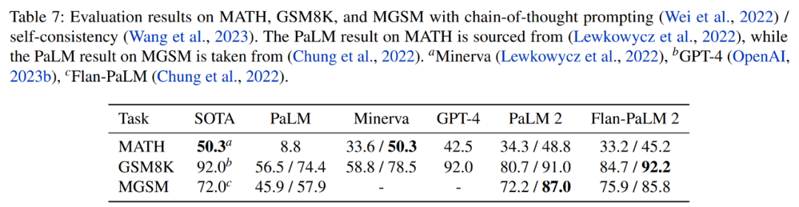

# AI探索者周刊 2023-05 第2周

## 1. FLOWGPT
FLOWGPT网站提供了很多优秀的Prompt提示词模板,也可以通过关键字搜索获取。大大提高了工作效率!支持中文和英文,而且在该网站可以直接跳转到ChatGPT官网使用。网站提示词内容涵盖了学术研究、市场、代码开发、商业等各个方面。

[FLOWGPT](https://flowgpt.com/)

## 2. AI图片生成案例
盐言故事的封面生成，使用ai的逻辑是：关键词输入给chatgpt，按要求扩写，增加细节，生成promopt再输入给novelai生成图片。

## 3. PaLM全面升级

3.Google I/O会上宣布，PaLM全面升级。

[Palm2TechReport.pdf](../../../assets/pdf/2023/05/Palm2TechReport.pdf)
